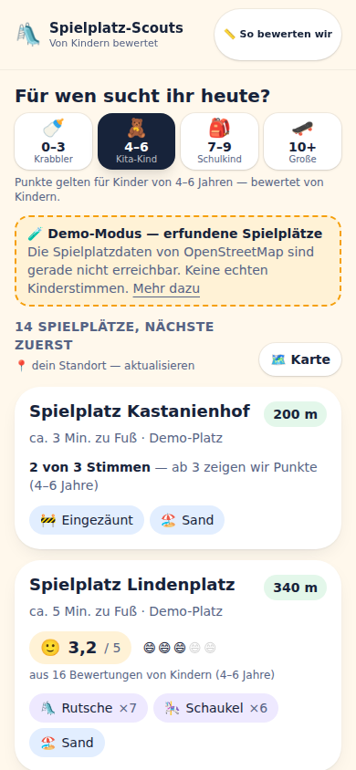
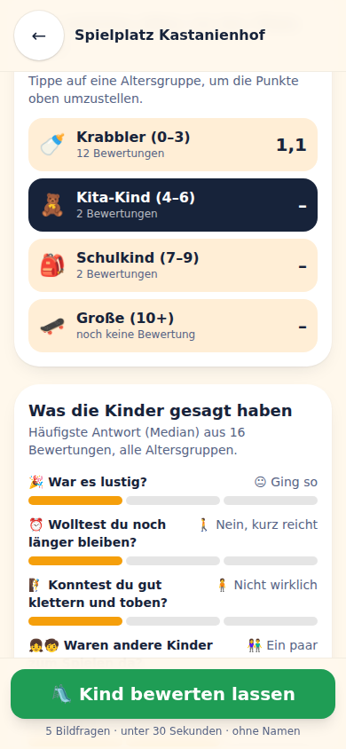
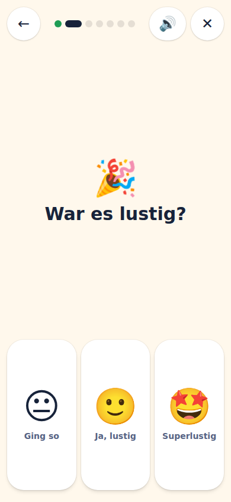
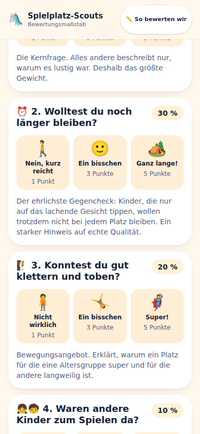

# 🛝 Spielplatz-Scouts

**Spielplätze, bewertet von den einzigen echten Experten: den Kindern.**

Eltern finden Spielplätze heute über Google Maps oder Zufall. Die Bewertungen dort stammen von
Erwachsenen und messen Erwachsenenkriterien — Sauberkeit, Parkplatz, Bänke. Die eigentliche Frage
beantwortet niemand: *Hat mein Kind hier Spaß?*

Spielplatz-Scouts dreht das um. Das **Kind** bewertet, in fünf Bildfragen, unter 30 Sekunden,
vollständig anonym. Die einzige erfasste Angabe ist das Alter — und genau die macht den
Unterschied: Ein Kletterturm ist für Zehnjährige großartig und für Zweijährige unbrauchbar.

📄 [Geschäftsmodell und Erfolgskriterien](docs/GESCHAEFTSMODELL.md)

| Suchen | Entscheiden | Bewerten | Nachvollziehen |
|---|---|---|---|
|  |  |  |  |

*(Screenshots im Demo-Modus — die Entwicklungsumgebung hatte keinen Zugang zu OpenStreetMap.)*

---

## Was die App kann

| Seite | Zweck |
|---|---|
| `/` | Spielplätze in der Nähe, nach Entfernung sortiert, mit Punktwert für die gewählte Altersgruppe |
| `/karte/` | Dieselben Plätze auf der Karte, Punktwert direkt im Pin |
| `/spielplatz/?id=` | Detail: Punkte je Altersgruppe, Antwortverteilung, Lieblingsgeräte, Navigation |
| `/bewerten/?id=` | Kinder-Modus: Vollbild, eine Frage pro Bildschirm, Vorlesefunktion, Belohnung |
| `/so-bewerten-wir/` | Der vollständige Bewertungsmaßstab — Fragen, Gewichte, Rechenweg |
| `/kommunen/` | Das B2G-Angebot (Kinderbeteiligung für Städte und Gemeinden) |
| `/datenschutz/` | Was gespeichert wird, was nicht, und ein Löschknopf |

## Der Bewertungsmaßstab

Fünf Fragen, je drei Bildantworten, keine Lesekompetenz nötig:

| Frage | Gewicht |
|---|---|
| War es lustig? | 40 % |
| Wolltest du noch länger bleiben? | 30 % |
| Konntest du gut klettern und toben? | 20 % |
| Waren andere Kinder zum Spielen da? | 10 % |
| War es schön schattig? | **0 %** — eigenes Abzeichen, kein Spaßkriterium |

Antworten werden zu Punkten (1 / 3 / 5), je Frage über den **Median** zusammengefasst und
gewichtet addiert. Ergebnis: Spaß-Punkte von 1 bis 5, **immer getrennt nach Altersgruppe**
(0–3 · 4–6 · 7–9 · 10+). Ab drei Bewertungen je Gruppe wird ein Wert angezeigt.

Der gesamte Katalog steht in **einer** Datei — [`lib/questions.ts`](lib/questions.ts). Sowohl der
Kinder-Modus als auch die Transparenzseite rendern daraus. Gestellte Frage und erklärte Frage
können damit strukturell nicht auseinanderlaufen.

## Datenhaltung

- **Kein Konto, kein Login, kein Tracking, keine Werbung.**
- Gespeichert werden nur: Spielplatz-ID, Alter, fünf Antworten, Tagesdatum (ohne Uhrzeit).
- In dieser Fassung liegt alles im **localStorage des Browsers** — nichts geht an einen Server.
- Der Standort verlässt das Gerät nicht; an OpenStreetMap geht nur eine auf ~1 km gerundete
  Umkreisanfrage.

## Spielplatzdaten

Alle Plätze kommen aus **OpenStreetMap** (`leisure=playground`, ODbL) über die Overpass-API.
Damit ist das Verzeichnis ab Tag 1 gefüllt — Bewertungen sind die Anreicherung, nicht die
Voraussetzung. Ergebnisse werden 24 Stunden im Gerät zwischengespeichert.

### Demo-Modus

Ist Overpass nicht erreichbar oder liegt kein Spielplatz im Umkreis, schaltet die App sichtbar in
den Demo-Modus: erfundene Plätze mit generierten Bewertungen, überall als Demo gekennzeichnet.
Manuell startbar über `/?demo=1` oder den Link im Fuß der Startseite.

**Echte OSM-Plätze zeigen ausschließlich echte Stimmen.** Ein unbewerteter Platz bleibt sichtbar
unbewertet — er wird nicht künstlich aufgefüllt.

---

## Entwicklung

```bash
npm install
npm run dev       # http://localhost:3000
npm run build     # statischer Export nach out/
npm run typecheck
```

Stack: Next.js 16 (App Router, `output: "export"`), TypeScript, Tailwind CSS v4, Leaflet.
Kein Server, keine Datenbank, keine laufenden Kosten.

## Bildzeichen

Die Bildzeichen stammen aus **Fluent Emoji** (Microsoft, MIT-Lizenz) und liegen als SVG im
Bundle — zur Laufzeit wird nichts nachgeladen, und sie sehen auf jedem Gerät gleich aus.
Eigene Zeichnungen gibt es nur für Schaukel, Wippe, Zaun und Trampolin (dafür existiert kein
Emoji) sowie für die gefüllten Uhren, die als Mengenskala entworfen sind.

Satz neu erzeugen nach einer Änderung der Zuordnung:

```bash
node scripts/emoji-generieren.mjs
```

## Deployment auf Google Cloud

### Variante A — Firebase Hosting (empfohlen, Spark-Tarif = 0 €, keine Kreditkarte)

📘 **[Ausführliche Schritt-für-Schritt-Anleitung](docs/DEPLOYMENT-FIREBASE.md)** — vom leeren
Google-Konto bis zur öffentlichen Adresse, inklusive Prüfliste und Fehlerbehebung.

Kurzfassung, wenn du Firebase schon kennst:

```bash
npm install -g firebase-tools
firebase login
firebase use --add            # Projekt wählen, Alias "default"
firebase deploy --only hosting
```

`firebase.json` liegt fertig konfiguriert bei: `out/` als Wurzel, `trailingSlash`, Cache-Header
für `/_next/static/**`, `no-cache` für den Service Worker und ein `predeploy`-Haken, der
`npm run build` vor jedem Deploy ausführt. **`firebase init` nicht ausführen** — es würde diese
Konfiguration überschreiben.

### Variante B — Cloud Run (nginx-Container)

```bash
gcloud run deploy spielplatz-scouts \
  --source . \
  --region europe-west3 \
  --allow-unauthenticated
```

`Dockerfile` und `nginx.conf` liegen bei; der Container lauscht auf Port 8080.
Cloud Run benötigt ein aktives Billing-Konto, Firebase Hosting im Spark-Tarif nicht.

---

## Bekannte Grenzen

- **Bewertungen werden nicht geteilt.** Sie liegen im Browser des jeweiligen Geräts. Für echte
  gemeinsame Bewertungen braucht es einen Server (siehe Roadmap).
- **Der Live-Pfad zu OpenStreetMap wurde nicht unter Last getestet.** Die Entwicklungsumgebung
  hatte keinen Netzzugang zu `overpass-api.de` und `tile.openstreetmap.org`; lokal lief deshalb
  der Demo-Modus, und Kartenkacheln blieben grau. Der Code ist Standard-CORS/fetch — **nach dem
  ersten Deploy einmal prüfen**, ob Liste und Karte echte Daten zeigen.
- Das Kommunen-Dashboard ist beschrieben, aber nicht gebaut.

## Roadmap

1. Server für geteilte Bewertungen (Supabase oder Cloud Firestore) — der Adapter dafür ist in
   `lib/ratings.ts` isoliert.
2. Plausibilitätsprüfung über Standortnähe beim Abgeben einer Bewertung.
3. Kommunen-Dashboard mit Export.
4. Filter für Eltern (Schatten, Zaun, WC, Wasser) und Merklisten.
5. QR-Code-Schilder je Spielplatz — der Link `/bewerten/?id=…` funktioniert dafür bereits.

## Lizenz und Daten

Spielplatzdaten und Kartenkacheln: © OpenStreetMap-Mitwirkende, [ODbL](https://www.openstreetmap.org/copyright).
